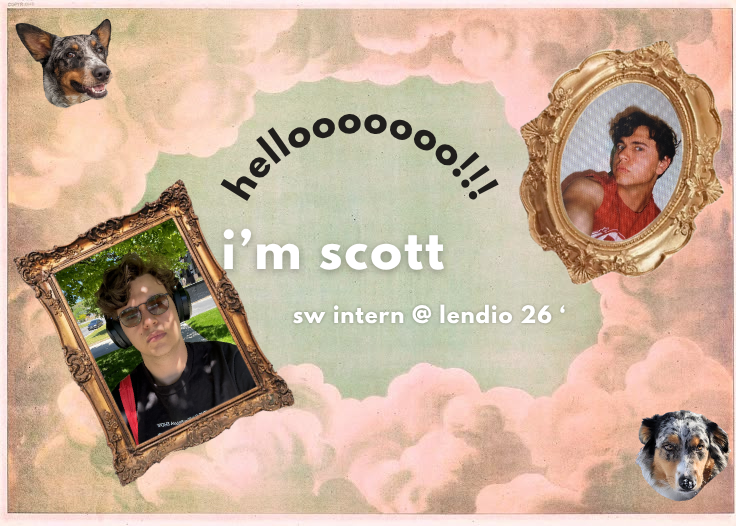

<table>
  <tr>
    <td align="center">
      
       
    </td>
  </tr>
</table>

* 🎓 Upcoming **BS in Computer Science** & BFA in Theatre from Westminster University ('27)
* 💻 Interests: Web & Software Development | Generative AI | UI/UX Design
* 📫 Reach me at: **scottalvaro@icloud.com**

---

## 🧠 Languages & Tools

